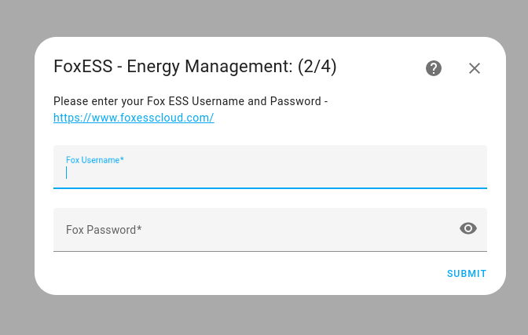
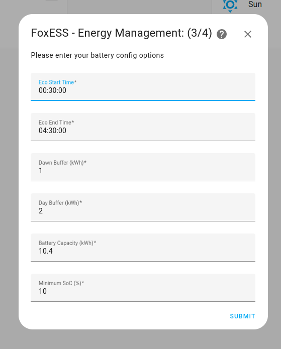
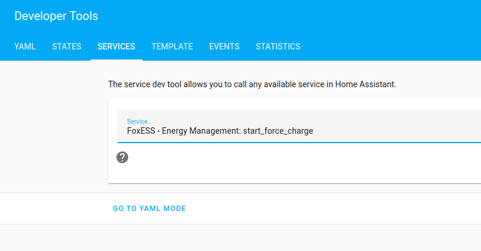

# FoxESS - Energy Management

[![GitHub Release][releases-shield]][releases]
[![GitHub Activity][commits-shield]][commits]
[![License][license-shield]](LICENSE)

[![pre-commit][pre-commit-shield]][pre-commit]
[![Black][black-shield]][black]

[![hacs][hacsbadge]][hacs]
[![Project Maintenance][maintenance-shield]][user_profile]
[![BuyMeCoffee][buymecoffeebadge]][buymecoffee]

[![Discord][discord-shield]][discord]
[![Community Forum][forum-shield]][forum]

\*\* **This project is not endorsed by, directly affiliated with, maintained, authorized, or sponsored by FoxESS** \*\*

## Introduction

A Home Assistant custom component designed to maximises solar, battery and grid usage and avoid peak rate tarriffs.

This integration will ensure that your home batteries are charged to the optimal level when the forecasted solar output drops below your daily average usage. The integration will also ensure that, given a day where the solar forecast is greater than your daily average usage, the battery has enough charge to last until dawn.

To further ease managing the battery state, the integration includes a switch to boost (+1kW) the battery charge and a second switch to charge fully; this is useful for times when you expect a higher than average load.

Example showing the integration:

- Charging the battery off-peak (3:24am -> 4:30am) as the battery wouldn't have last until dawn (i.e. when the solar takes over)
- Forecasted solar charging the battery (9:21am -> 12:20pm) up to ~80%
- Base house load consuming battery (12:20pm -> 3:25am) to a minimum of 15%
- Repeat


### Assumptions/Dependencies

These may change as development progresses:

- Only one FoxESS inverter is supported

## Installation

Recommend installation through [HACS][hacs]

1. Navigate to HACS integrations
2. Hit the menu button (top right) and select 'Custom repositories'
3. Paste this GitHub [link][foxess_em] and select 'Integration'
4. Install as usual through HACS
   - 'Explore & Download Repositories'
   - Search for 'FoxESS...'
   - Download

## Configuration and Options

<details>
    <summary><b>Solcast Setup</b></summary></p>

- **API Key**: API Key from Solcast Toolkit


</details>

<details>
    <summary><b>Inverter Connection Setup</b></summary></p>

Choose from one of the following options:



<b>Modbus TCP (Only compatible with RTU -> TCP devices, not direct LAN)</b>

- **Modbus Host**: IP Adddress of your Modbus (i.e. W610) host
- **Modbus Port**: Port number (default 502)
- **Modbus Slave**: Slave ID (default 247)


<b>Modbus Serial</b>

- **Modbus Host**: Path to your USB host (default /dev/ttyUSB0)
- **Modbus Slave**: Slave ID (default 247)


<b>FoxESS Cloud</b>

- **Username**: Username from FoxESS Cloud
- **Password**: Password from FoxESS Cloud


</details>

<details>
    <summary><b>Battery Parameters</b></summary></p>

Enter your desired battery parameters:

- **Eco Start Time**: Start time of your off-peak period (i.e. 00:30 on Octopus Go)
- **Eco End Time**: End time of your off-peak period (i.e. 4:30 on Octopus Go)
- **Dawn Buffer**: As forecasts and usage patterns can change, leave a buffer to ensure the battery doesn't get too close to empty
- **Day Buffer**: As above, but for the day
- **Battery Capacity**: Capacity of battery in kWh
- **Minimum SoC**: Minimum State of Charge as set in the FoxESS App

If using Modbus connection:

- **Charge Rate**: Nominal charge rate in A - for a 3.6kw inverter this should be ~18A
- **Battery Volts**: Nominal battery voltage in V - i.e. 4 x HV2600 is ~220V



</details>

<details>
    <summary><b>Home Assistant Sensors</b></summary></p>

- **Battery SoC**: Battery State of Charge sensor - must be an integer %
- **House Power**: House load power - must be kW
- **Aux Power**: Aux sensors to remove from the house power, i.e. an Eddi, Zappi charger etc. which will skew the base house load calculations - must be W


</details>

## Sensors and Switches

<details>
    <summary><b>Sensors</b></summary></p>

Description of sensors:

Notes:

- all capacity values are forward looking to the next period once past the eco-start time</br>

| Sensor                       | Description                                                                            | Attributes                                                                  |
| ---------------------------- | -------------------------------------------------------------------------------------- | --------------------------------------------------------------------------- |
| Capacity: Battery Empty Time | Forecasted time battery will be depleted (Unknown if battery is empty)                 |                                                                             |
| Capacity: Charge Needed      | Charge needed for the next off-peak period                                             | Dawn charge needed </br> Day charge needed </br> Min SoC                    |
| Capacity: Eco Start          | Forecasted battery capacity at the start of the off-peak period                        |                                                                             |
| Capacity: Next Dawn Time     | Forecasted next dawn time (i.e. solar output > house load)                             |                                                                             |
| Capacity: Peak Grid Export   | Forecasted solar export to grid until the next off-peak period                         |                                                                             |
| Capacity: Peak Grid Import   | Forecasted import from grid until the next off-peak period                             |                                                                             |
| Forecast: API Count          | Number of hits against the Solcast API                                                 |                                                                             |
| Forecast: Today              | Forecasted solar output for today                                                      |                                                                             |
| Forecast: Today Remaining    | Forecasted solar output remaining (resampled to 1Min for continual updates)            |                                                                             |
| Forecast: Tomorrow           | Forecasted solar output for tomorrow                                                   |                                                                             |
| Last Update                  | Last update time                                                                       | Battery last update</br> Forecast last update</br> Average last update</br> |
| Load: Daily                  | Total load, averaged over the last 2 complete days                                     |                                                                             |
| Load: Peak                   | Peak only load (i.e. outside of the Go period), averaged over the last 2 complete days |                                                                             |
| FoxESS EM: Schedule          | Entity to persist the schedule                                                         | Schedule stored as JSON                                                     |
| FoxESS EM: Raw Data          | Entity to persist the the raw data for graphing purposes                               | Raw data stored as JSON - disabled by default                               |

</details>

<details>
    <summary><b>Switches</b></summary></p>

Description of switches:

| Switch                              | Description                                                                                                                              |
| ----------------------------------- | ---------------------------------------------------------------------------------------------------------------------------------------- |
| Boost Charge (+1kW)                 | Adds 1kW to the charge needed sensor. Resets after the charge period.                                                                    |
| Disable Auto Charge                 | Prevents the integration from changing FoxESS settings to auto-charge or setting Min-SoC                                                 |
| Full Charge                         | Fully charges the battery during off-peak. Resets after the charge period.                                                               |
| Custom Charge Profile (Modbus Only) | Uses a custom charge profile which reduces charge current to meet the desired SoC and further ramps when > 90% SoC to aid with balancing |

</details>

## Extras

<details>
    <summary><b>Graphing & Home Assistant Tweaks</b></summary>

<b>Important! Before following this guide add the following to your configuration.yaml to prevent the HA database becoming bloated</b>

```
recorder:
  exclude:
    entities:
      - sensor.foxess_em_raw_data
      - sensor.foxess_em_forecast
```

- Enable the FoxESS Raw Data entity from the entity settings:

</p>

- Install Apex Charts from HACS
- Use the templated example in the /apex-example folder

</p>

Dashed = predicted / Solid = actual</br>
Battery = blue / Load = pink / Solar = orange / Grid = green

</details>

<details>
    <summary><b>Energy Dashboard Forecast</b></summary>

</p>


</details>

<details>
    <summary><b>Service Calls</b></summary>

- Start force charge now
- Start force charge at off-peak
- Stop force charge

</p>

</details>

## Contributions are welcome!

If you want to contribute to this please read the [Contribution guidelines](CONTRIBUTING.md)

## Credits

Thanks to the awesome work from [oziee][ha_solcast] and [StealthChesnut][ha_modbus]

---

[black]: https://github.com/psf/black
[black-shield]: https://img.shields.io/badge/code%20style-black-000000.svg?style=for-the-badge
[buymecoffee]: https://www.buymeacoffee.com/nathanmarlor
[buymecoffeebadge]: https://img.shields.io/badge/buy%20me%20a%20coffee-donate-yellow.svg?style=for-the-badge
[commits-shield]: https://img.shields.io/github/commit-activity/y/nathanmarlor/foxess_em.svg?style=for-the-badge
[commits]: https://github.com/nathanmarlor/foxess_em/commits/main
[hacs]: https://hacs.xyz
[hacsbadge]: https://img.shields.io/badge/HACS-Custom-orange.svg?style=for-the-badge
[discord]: https://discord.gg/Qa5fW2R
[discord-shield]: https://img.shields.io/discord/330944238910963714.svg?style=for-the-badge
[foxessimg]: https://github.com/home-assistant/brands/raw/master/custom_integrations/foxess/logo.png
[foxess_em]: https://github.com/nathanmarlor/foxess_em
[forum-shield]: https://img.shields.io/badge/community-forum-brightgreen.svg?style=for-the-badge
[forum]: https://community.home-assistant.io/
[license-shield]: https://img.shields.io/github/license/nathanmarlor/foxess_em.svg?style=for-the-badge
[maintenance-shield]: https://img.shields.io/badge/maintainer-%40nathanmarlor-blue.svg?style=for-the-badge
[pre-commit]: https://github.com/pre-commit/pre-commit
[pre-commit-shield]: https://img.shields.io/badge/pre--commit-enabled-brightgreen?style=for-the-badge
[releases-shield]: https://img.shields.io/github/release/nathanmarlor/foxess_em.svg?style=for-the-badge
[releases]: https://github.com/nathanmarlor/foxess_em/releases
[user_profile]: https://github.com/nathanmarlor
[ha_modbus]: https://github.com/StealthChesnut/HA-FoxESS-Modbus
[ha_solcast]: https://github.com/oziee/ha-solcast-solar
